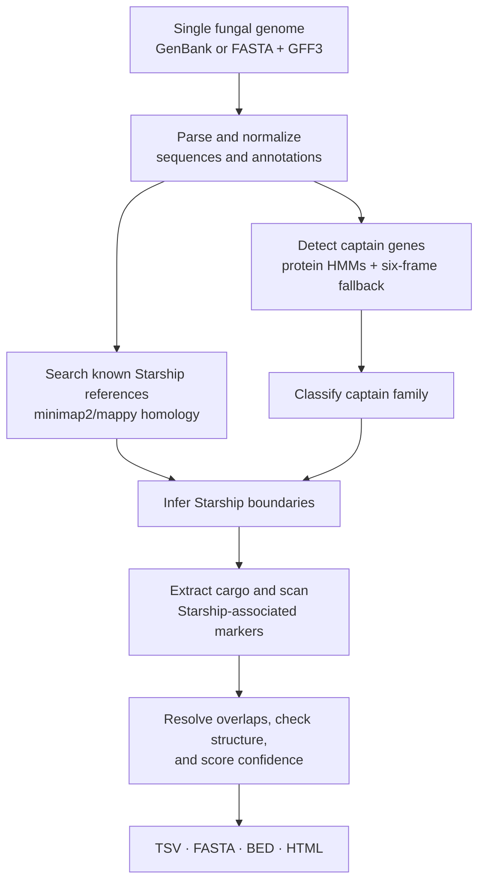

# StarKIT

StarKIT is a beta command-line tool for identifying Starship transposable
elements in a single fungal genome. It combines captain-gene detection,
homology to known Starships, boundary inference, and cargo annotation to
produce TSV, FASTA, BED, and HTML results.

## How StarKIT works



1. **Read the genome.** StarKIT accepts one annotated GenBank genome or a
   FASTA genome paired with a GFF3 annotation.
2. **Find captain genes.** Protein HMM searches identify candidate tyrosine
   recombinases, with a six-frame genome search as a fallback for captains
   missing from the annotation.
3. **Search reference Starships.** Nucleotide homology detects regions related
   to known Starships and can reconstruct rearranged elements from conserved
   reference fragments.
4. **Classify and define boundaries.** Captain-family HMMs assign a family,
   while boundaries are chosen from homology, family-specific direct repeats,
   MYB/SANT markers, or a size-based estimate.
5. **Annotate cargo and markers.** Genes inside each candidate element are
   collected and screened for Starship-associated domains such as MYB/SANT
   and DUF3723.
6. **Consolidate and score predictions.** Overlapping calls are resolved,
   structural flags are recorded, and each Starship receives a confidence
   score and evidence level.
7. **Write results.** StarKIT produces a tabular summary, extracted Starship
   sequences, genomic intervals, and an interactive HTML report.

## Local installation for beta testers

StarKIT requires Git and Python 3.9 or newer. We recommend installing it in a
dedicated virtual environment.

```bash
git clone https://github.com/JLSteenwyk/starkit.git
cd starkit

python3 -m venv .venv
source .venv/bin/activate

python -m pip install --upgrade pip
python -m pip install -e .
```

On Windows PowerShell, activate the environment with:

```powershell
.\.venv\Scripts\Activate.ps1
```

Confirm that the installation works:

```bash
starkit --version
starkit --help
```

## Quick start

Run StarKIT on an annotated GenBank genome:

```bash
starkit genome.gbk -o genome_results
```

FASTA input requires a matching GFF3 annotation:

```bash
starkit genome.fasta --gff genome.gff3 -o genome_results
```

StarKIT is under active beta development. Please report the command used,
console output, and relevant input details when sharing a problem.
